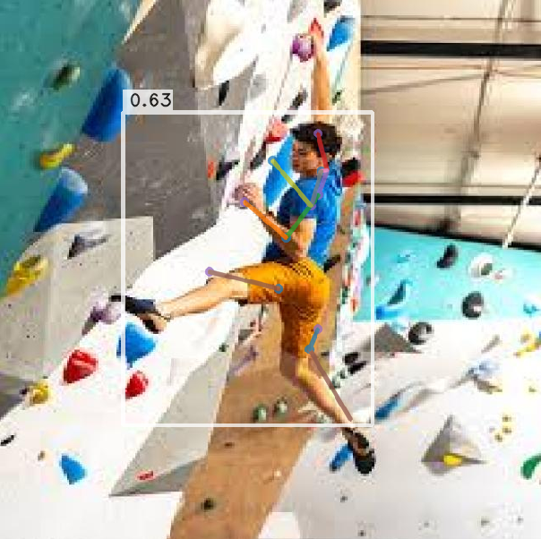
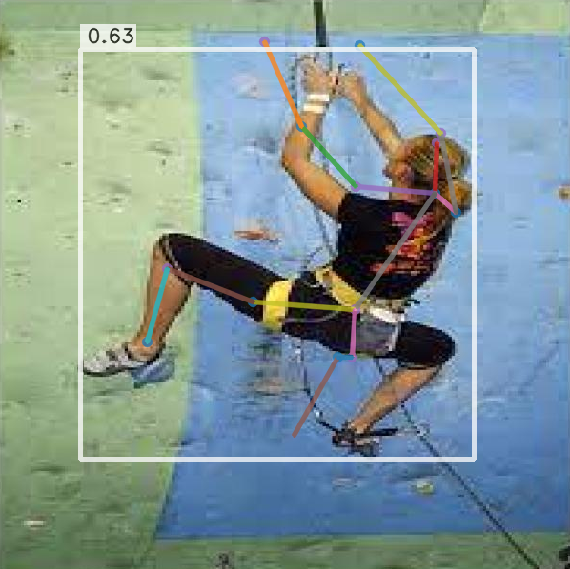
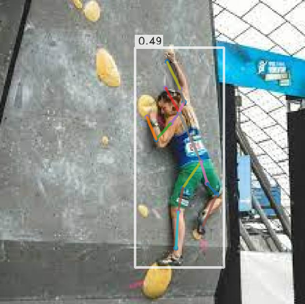
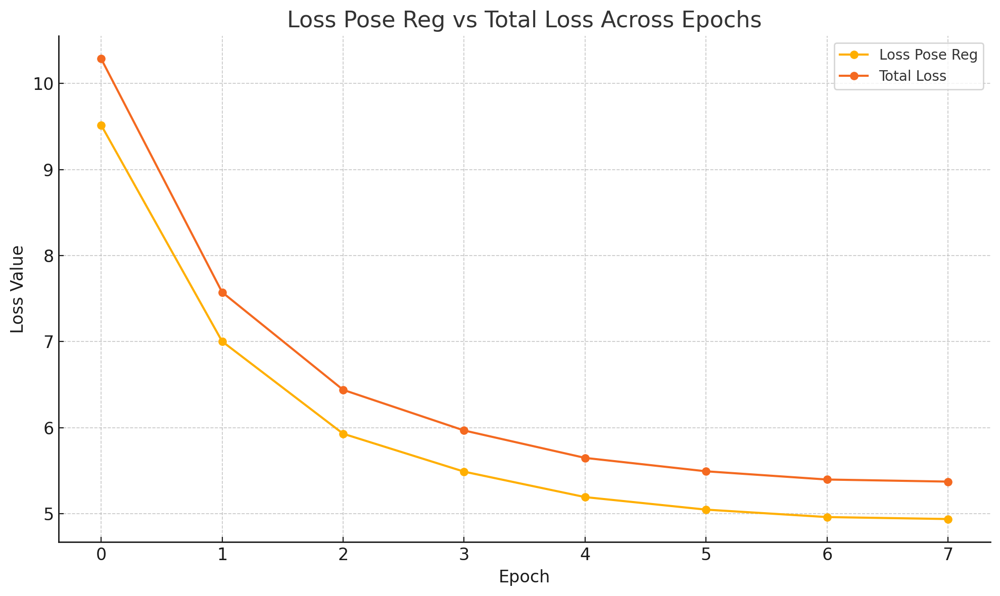
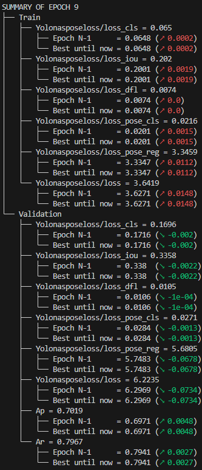

# 🧗 Computer Vision–Based Training for Rock Climbing

This project explores the use of **computer vision and human pose estimation** to enhance training for **rock climbing**, specifically board climbing scenarios (e.g. Kilter Board / MoonBoard).  
A custom pose estimation model is trained to track climber body positions and provide **quantitative and visual feedback** on technique, movement, and posture.

---

## 📌 Project Overview

Rock climbing relies heavily on precise body positioning, balance, and movement efficiency. Traditional training methods often lack objective feedback.

This project applies **deep learning–based pose estimation** to:
- Track climber body joints on indoor climbing walls
- Analyse posture and movement patterns
- Lay groundwork for technique comparison and injury prevention tools

The final model is trained on a **custom annotated dataset** using the **YOLO-NAS-POSE-L** architecture.

---

## 🧠 Methodology

### Model
- **Architecture:** YOLO-NAS-POSE-L (DeciAI / NVIDIA)
- **Framework:** SuperGradients
- **Trained on:** Custom climbing dataset

### Dataset
- **Total images:** 3,599  
- **Keypoints:** 15 joints (head, shoulders, elbows, wrists, hips, knees, ankles)
- **Splits:**
  - Training: 82%
  - Validation: 13%
  - Testing: 5%
- **Annotation format:** COCO

### Training Setup
- **Epochs:** 8  
- **Batch size:** 8  
- **Optimizer:** AdamW  
- **Learning rate:** 5e-5 (cosine decay)  
- **Hardware:** GPU

---

## 📊 Results

### Pose Estimation Outputs

  
  
  

*Figure 1: Pose estimation predictions on different climbing images*

---

### Average Precision (AP)

  

- AP improved from **0.51 → 0.74**
- Indicates improved keypoint detection accuracy across training

---

### Training Loss

  

- Total validation loss reduced by nearly **50%**
- Largest improvement observed in **pose regression loss**

---

### Training Summary

  

Final epoch metrics:
- **AP:** 0.7369  
- **AR:** 0.8248  
- **Total loss:** 5.37  

The steady decline in loss and increase in precision indicate successful convergence.

---

## 🎥 Video Demo

A short demo showcasing pose estimation on climbing footage:

[Download demo video](test.mp4)

---

## ⚠️ Limitations

- Performance degrades under extreme camera angles
- Lighting and wall colour affect prediction accuracy
- Single-frame inference (no temporal consistency)

---

## 🔮 Future Work

- Expand dataset diversity (wall types, climber demographics)
- Incorporate video-based temporal pose estimation
- Pose overlay comparison between climbers
- Advanced architectures (GCNs, heatmap refinement)
- Real-time feedback tools for training environments

